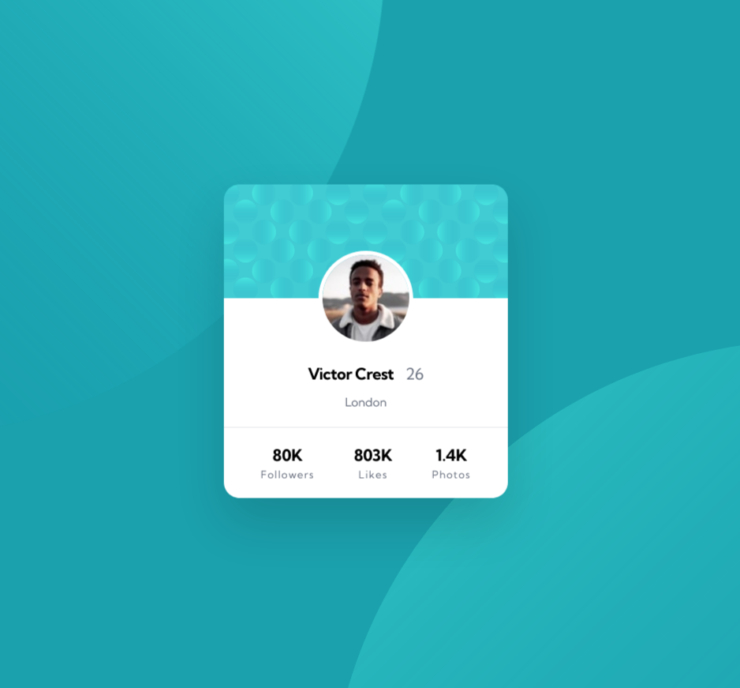

# Frontend Mentor - Profile card component solution

This is a solution to the [Profile card component challenge on Frontend Mentor](https://www.frontendmentor.io/challenges/profile-card-component-cfArpWshJ). Frontend Mentor challenges help you improve your coding skills by building realistic projects.

## Table of contents

- [Overview](#overview)
  - [The challenge](#the-challenge)
  - [Screenshot](#screenshot)
  - [Links](#links)
- [My process](#my-process)
  - [Built with](#built-with)
  - [What I learned](#what-i-learned)
  - [Continued development](#continued-development)
  - [Useful resources](#useful-resources)
- [Author](#author)
- [Acknowledgments](#acknowledgments)

## Overview

### The challenge

- Build out the project to the designs provided

### Screenshot



### Links

- Solution URL: [Github Repo](https://github.com/ironcladmerc/profile-card-component)
- Live Site URL: [Vercel](https://profile-card-component-chi-orcin.vercel.app/)

## My process

### Built with

- Tailwind CSS
- CSS
- Flexbox
- [Next.js](https://nextjs.org/) - React framework

### What I learned

I learned how to use multiple images in the background using the CSS background property. It seems like I need to repeat the background-color in the media query, otherwise the background color went white. I'm still not sure why. To use this in Next.js, all we have to do is put these styles in the styles/globals.css file after the three @import directives for Tailwind.

```css
.card-background {
    background: url("/bg-pattern-bottom.svg") no-repeat 730px 280px, url("/bg-pattern-top.svg") no-repeat -190px -530px;
    background-color: hsl(185, 75%, 39%);
}

@media only screen and (max-width:500px) {
    .card-background {
        background:  url("/bg-pattern-bottom.svg") no-repeat 190px 300px,url("/bg-pattern-top.svg") no-repeat -140vw -70vh;
        background-color: hsl(185, 75%, 39%);
```

I also learned how to use background images in Tailwind. To use it, we need to put a backgroundImage object into the tailwind.config.js file and give a name to all the background images you want to use. Then they will be available as classes starting with bg-. Ultimately I did not actually use this because I couldn't figure out how to use 2 background images at the same time with Tailwind.

```json
    extend: {
      backgroundImage: {
        "pattern-bottom": "url('/bg-pattern-bottom.svg')",
        "pattern-card": "url('/bg-pattern-card.svg')",
        "pattern-top": "url('/bg-pattern-top.svg')",
      },
```

### Continued development

I need to learn more about vanilla CSS, as well as more looking into tailwindcss to see if there's a way to use multiple background images in a tailwind class. I didn't find one, so I used regular CSS for it.

### Useful resources

- [W3Schools CSS Background Property](https://www.w3schools.com/cssref/css3_pr_background.asp) - This helped me understand how to use the CSS background property.

- [Tailwind Background Image Documentation](https://tailwindcss.com/docs/background-image#customizing-your-theme) - This helped me understand how to use background images in Tailwind.

## Author

- Frontend Mentor - [@ironcladmerc](https://www.frontendmentor.io/profile/ironcladmerc)

## Acknowledgments

To get the background image working, I peeked at the solution that ChMohitKaPage submitted for this challenge. I was not supposed to see that, but it came up as the first result in a google search. So, thanks to [ChMohitKaPage](https://www.frontendmentor.io/profile/ChMohitKaPage).
